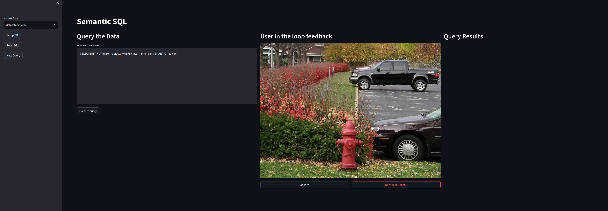

# Semantic SQL
SQL queries that support semantic predicates as well
<p align="center">
  
</p>

## Setup
- Clone this repository **RECURSIVELY**. It has a submodule.
```bash
git clone --recursive git@github.com:akash17mittal/semantic-sql.git
```
- Download the data [Google Drive Link](https://drive.google.com/file/d/1RFjTyfs7KhhowRByKyW9KABJUSVEID-S/view?usp=sharing)
- Unzip the data and keep it in the project directory
- Install the requirements
```python
pip install -r requirements.txt
```
- Run the command to start
```python
streamlit run main.py
```
This command starts the semantic-sql at the following address http://localhost:8501/

- Click **Setup DB** button to create and populate the database table and build the vector index. Wait for sometime, this may take upto ~30 seconds. This step is only required for the first time. You don't need to run this again ever in the future unless you click **Reset DB**
- Every time, you want to run a query, click **New Query** button.
- Type in the __sql__ query and click **Execute Query**

### Features
- **SQL Expansion:** In addition to the standard SQL syntax, user can specify SEMANTIC predicate at the end of the sql query as shown in the example queries below.
- **Human in Loop Feedback:** If a user specifies semantic predicate, the system will show the example images and user needs to provide feedback whether the shown image satisfies the semantic predicate or not. This step is required to choose the appropriate threshold.
- **Results:** At the end, results are shown as a pandas dataframe along with the top-3 image matches.

### Example SQL Queries
- Images containing exact 2 people and men wearing suit.
```sql
SELECT id, COUNT(*) as c
FROM objects
WHERE class_name='person'
GROUP BY id
HAVING c = 2
SEMANTIC 'men in suit'
```
- Images having red car in the bottom right corner.
```sql
SELECT DISTINCT id
FROM objects
WHERE class_name='car' AND x2>250 AND y2 > 200
SEMANTIC 'red car'
```
- Images having both plane and women
```sql
SELECT DISTINCT id from objects WHERE class_name='person' 
INTERSECT
SELECT DISTINCT id from objects WHERE class_name='airplane' 
SEMANTIC 'women'
```
- Images with one person with umbrella and two cars
```sql
SELECT id
FROM
  (SELECT id,
          COUNT(*) AS c
   FROM objects
   WHERE class_name='person'
   GROUP BY id
   HAVING c = 1) INTERSECT
SELECT DISTINCT id
FROM objects
WHERE class_name='umbrella' INTERSECT
  SELECT id
  FROM
    (SELECT id,
            COUNT(*) AS c
     FROM objects
     WHERE class_name='car'
     GROUP BY id
     HAVING c = 2)
SEMANTIC 'women no kids'
```
- Images with black cat on the top left corner
```sql
SELECT 
  DISTINCT id 
from 
  objects 
WHERE 
  class_name = 'cat' 
  AND x2 < 250 
  AND y2 < 250 
SEMANTIC 'black cat'
```